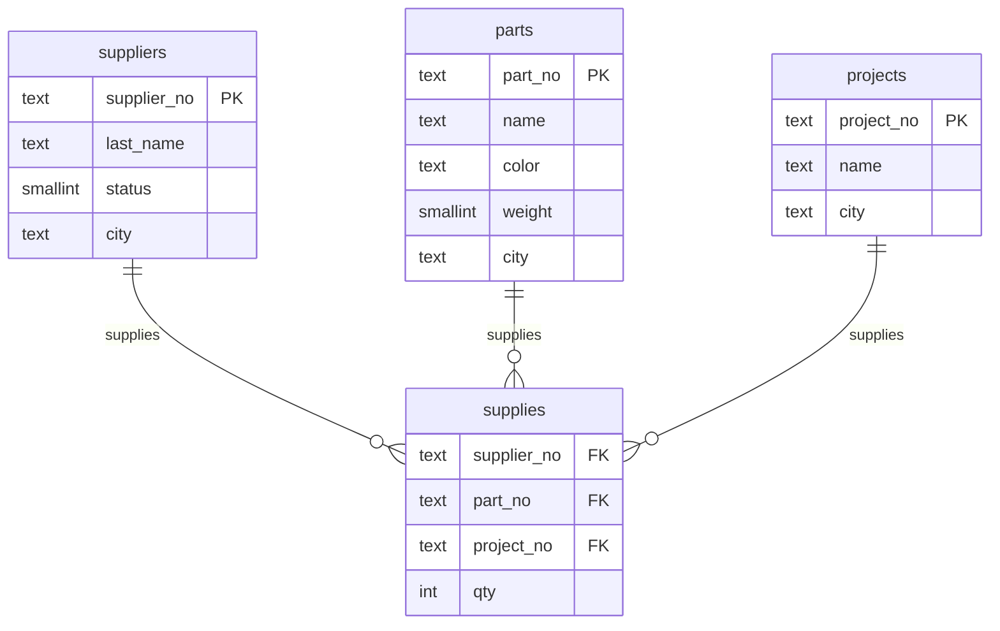

# SPJ (Suppliers–Parts–Projects) — PostgreSQL 18 Exercises

Clean implementation of the classic **S–P–J** dataset with **PostgreSQL 18** and a complete set of SQL tasks (in Russian) from two screenshots:

- **Screenshot #1** — the four tables (S, P, J, SPJ) with sample rows.
- **Screenshot #2** — the list of tasks grouped in sections 1–7.

This repo provides:
- Production-grade DDL (explicit schema, constraints, FK indexes).
- Seed data matching the screenshot (Russian names and cities).
- Readable queries split by task sections.
- A quick way to run everything from scratch.

> **Note:** The original task text is in Russian. Each query in `/queries` starts with the Russian description and task number (e.g., `-- 1.3`).

---

## Quick Start

```bash
# 0) Create DB and schema (run as a superuser or a role with createdb)
psql -v ON_ERROR_STOP=1 -f 01-db-setup/00_create_database.sql

# 1) Connect as app role (change the password in 00_create_database.sql!)
psql -d spj_db -U spj_user

-- In psql prompt, load schema and data:
\i 01-db-setup/01_schema.sql
\i 01-db-setup/02_seed.sql

-- Optional: verify search_path (00_create_database.sql already set for the DB)
SHOW search_path;

-- 2) Run queries section by section
\i 02-queries/01_restricted_selects.sql
\i 02-queries/02_filters_between_in_like_null.sql
\i 02-queries/03_joins_and_combinations.sql
\i 02-queries/04_subqueries.sql
\i 02-queries/05_aggregates.sql
\i 02-queries/06_group_by_having.sql
\i 02-queries/07_unions.sql
```
---

## Tear down (drop database)

> **⚠️ Irreversible:** The following actions permanently remove data/schemas/roles.  
> Double-check the target database and run only if you intend to destroy data.

You have two supported paths:

### A) Full removal (drop the entire database)
Use when you want to delete **spj_db** completely. Run from DB `postgres` with a superuser.

**Linux/macOS**
```bash
# Drop the database
psql -U postgres -d postgres -v ON_ERROR_STOP=1 \
  -f 03-db-drop/00_drop_database.sql

# (Optional) Drop the application role after DB removal
psql -U postgres -d postgres -v ON_ERROR_STOP=1 \
  -f 03-db-drop/02_drop_role.sql
```

**Windows PowerShell**
```powershell
# Drop the database
psql.exe -U postgres -d postgres -v ON_ERROR_STOP=1 `
  -f ".\03-db-drop\00_drop_database.sql"

# (Optional) Drop the application role after DB removal
psql.exe -U postgres -d postgres -v ON_ERROR_STOP=1 `
  -f ".\03-db-drop\02_drop_role.sql"
```

### B) In-place reset (keep the DB, reset schema contents)
Use when you want a clean `spj` schema but keep the `spj_db` database.

**Linux/macOS**
```bash
# Connect to spj_db (owner or superuser) and reset schema spj
psql -U spj_user -d spj_db -v ON_ERROR_STOP=1 \
  -f 03-db-drop/01_drop_schema_objects.sql

# Alternatively, as superuser:
# psql -U postgres -d spj_db -v ON_ERROR_STOP=1 -f 03-db-drop/01_drop_schema_objects.sql
```

**Windows PowerShell**
```powershell
# Reset schema spj while keeping the database
psql.exe -U spj_user -d spj_db -v ON_ERROR_STOP=1 `
  -f ".\03-db-drop\01_drop_schema_objects.sql"

# Alternatively, as superuser:
# psql.exe -U postgres -d spj_db -v ON_ERROR_STOP=1 `
#   -f ".\03-db-drop\01_drop_schema_objects.sql"
```

See also: [`03-db-drop/README_DROP.md`](03-db-drop/README_DROP.md) for a short per-file guide.  
If an earlier variant used a role named `"user"`, `02_drop_role.sql` contains commented
fallback `DROP` statements for that role.

---

## ER Diagram



---

## Data Dictionary (short)

- **suppliers** (`supplier_no`, `last_name`, `status`, `city`) — suppliers, status ∈ [0..100].  
- **parts** (`part_no`, `name`, `color`, `weight`, `city`) — parts, `weight` > 0.  
- **projects** (`project_no`, `name`, `city`) — projects (a.k.a. изделия).  
- **supplies** (`supplier_no`, `part_no`, `project_no`, `qty`) — shipments (qty ≥ 0, can be NULL to represent unknown/unspecified quantity).

All PKs are **natural codes** (`S1`, `P1`, `J1`) with regex `^S\d+$`, `^P\d+$`, `^J\d+$`.  
All FKs are indexed for join performance.

---

## Code Style

- Explicit schema: `SET search_path = spj, public;`
- `snake_case` identifiers.
- No `SELECT *` — explicit column lists and aliases.
- Consistent, readable joins (`INNER/LEFT JOIN` syntax).
- Defensive constraints: `CHECK`, `NOT NULL` where appropriate.
- CTEs only where they improve clarity (not needed in the current set).

---

## UNION vs UNION ALL

- **UNION** removes duplicates (set semantics).  
- **UNION ALL** preserves duplicates (bag/multiset semantics).  
- This project defaults to **UNION ALL** unless the task explicitly requires a unique set; those places are commented.

---

## How to Inspect Plans

Run `EXPLAIN` or `EXPLAIN ANALYZE` before any query:

```sql
EXPLAIN ANALYZE
SELECT DISTINCT spj.supplier_no
FROM supplies AS spj
JOIN parts AS p ON p.part_no = spj.part_no
WHERE p.color = 'Красный';
```

---

## Notes on OCR and Assumptions

Some lines in Screenshot #2 are hard to read. Where the exact phrasing was unclear, the query is marked with an **Assumption** comment and follows the canonical SPJ exercise variants (co-location, set division, etc.). You can replace the comment with the exact wording if needed.

---

## License

MIT — do whatever you want, attribution appreciated.
