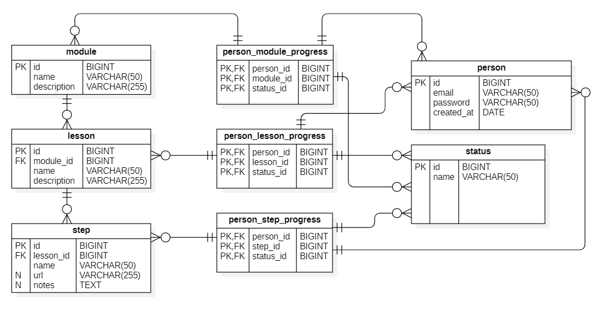
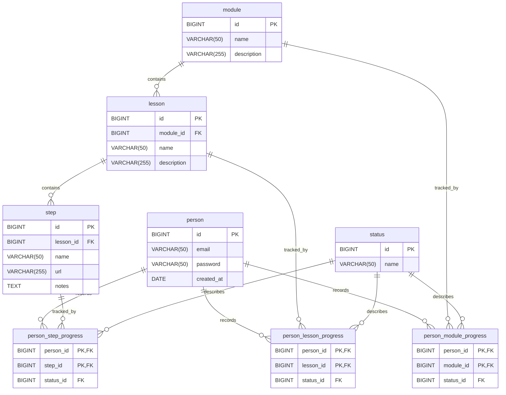

# RSL Learning Platform — Data Model
_A concise, production-quality schema for tracking learning progress across modules, lessons, and steps._

`PostgreSQL-ready` • `ERD Included` • `RSL Learning`

---

## Executive Overview
This data model powers an educational platform focused on **Russian Sign Language (RSL)**. The core
learning flow is simple: learners browse modules, open lessons, and consume lesson steps (short videos
and accompanying notes). To support clear analytics and a smooth learner experience, the platform
tracks progress at **three levels**—module, lesson, and step—so that the UI can resume where the
learner left off and educators can monitor outcomes.

> Source (translated):  
> “This is a database schema for a platform teaching RSL. The primary function is watching educational
> videos and reading lesson notes. The diagram shows: users; learning modules; lessons within a module;
> lesson steps with videos and notes; progress status (available, in progress, completed); and progress
> records for modules, lessons, and steps.”

---

## Diagram



### Mermaid ER Diagram


---

## Entity Overview
- **person** — registered learner account.
- **module** — a learning topic that groups lessons (e.g., “Alphabet Basics”).
- **lesson** — a unit within a module.
- **step** — a granular learning activity within a lesson (video and/or notes).
- **status** — dictionary of progress states (e.g., `available`, `in_progress`, `completed`).
- **person_module_progress** — learner’s status for a given module.
- **person_lesson_progress** — learner’s status for a given lesson.
- **person_step_progress** — learner’s status for a given step.

---

## Data Dictionary

> Types reflect the ERD. Nullability is stated explicitly; add `NOT NULL` as needed in your DDL.

### person
| Field        | Type         | Null | Notes                                  |
|--------------|--------------|------|----------------------------------------|
| id           | BIGINT       | NO   | Primary key                            |
| email        | VARCHAR(50)  | NO   | Unique login (add `UNIQUE` constraint) |
| password     | VARCHAR(50)  | NO   | See **Privacy & Security**             |
| created_at   | DATE         | NO   | Registration date                      |

**Constraints**: `PK(id)`  
**Indexes**: `UNIQUE(email)` (recommended)

---

### module
| Field       | Type          | Null | Notes        |
|-------------|---------------|------|--------------|
| id          | BIGINT        | NO   | Primary key  |
| name        | VARCHAR(50)   | NO   |              |
| description | VARCHAR(255)  | YES  |              |

**Constraints**: `PK(id)`  
**Indexes**: `(name)` (optional for search)

---

### lesson
| Field       | Type          | Null | Notes                      |
|-------------|---------------|------|----------------------------|
| id          | BIGINT        | NO   | Primary key                |
| module_id   | BIGINT        | NO   | FK → module(id)            |
| name        | VARCHAR(50)   | NO   |                            |
| description | VARCHAR(255)  | YES  |                            |

**Constraints**: `PK(id)`, `FK(module_id) → module(id)`  
**Indexes**: `(module_id)` for joins

---

### step
| Field      | Type          | Null | Notes                   |
|------------|---------------|------|-------------------------|
| id         | BIGINT        | NO   | Primary key             |
| lesson_id  | BIGINT        | NO   | FK → lesson(id)         |
| name       | VARCHAR(50)   | NO   |                         |
| url        | VARCHAR(255)  | YES  | Video or resource link  |
| notes      | TEXT          | YES  | Free-form notes         |

**Constraints**: `PK(id)`, `FK(lesson_id) → lesson(id)`  
**Indexes**: `(lesson_id)` for joins

---

### status
| Field | Type         | Null | Notes                     |
|-------|--------------|------|---------------------------|
| id    | BIGINT       | NO   | Primary key               |
| name  | VARCHAR(50)  | NO   | e.g., `in_progress`       |

**Constraints**: `PK(id)`, `UNIQUE(name)` (recommended)  
**Indexes**: `(name)` (optional)

---

### person_module_progress
| Field     | Type   | Null | Notes                         |
|-----------|--------|------|-------------------------------|
| person_id | BIGINT | NO   | FK → person(id)               |
| module_id | BIGINT | NO   | FK → module(id)               |
| status_id | BIGINT | NO   | FK → status(id)               |

**Constraints**: Composite `PK(person_id, module_id)`;  
`FK(person_id) → person(id)`, `FK(module_id) → module(id)`, `FK(status_id) → status(id)`  
**Indexes**: `(status_id)`, `(module_id)`, `(person_id)` (FK indexes)

---

### person_lesson_progress
| Field     | Type   | Null | Notes                         |
|-----------|--------|------|-------------------------------|
| person_id | BIGINT | NO   | FK → person(id)               |
| lesson_id | BIGINT | NO   | FK → lesson(id)               |
| status_id | BIGINT | NO   | FK → status(id)               |

**Constraints**: Composite `PK(person_id, lesson_id)`;  
`FK(person_id) → person(id)`, `FK(lesson_id) → lesson(id)`, `FK(status_id) → status(id)`  
**Indexes**: `(status_id)`, `(lesson_id)`, `(person_id)`

---

### person_step_progress
| Field     | Type   | Null | Notes                         |
|-----------|--------|------|-------------------------------|
| person_id | BIGINT | NO   | FK → person(id)               |
| step_id   | BIGINT | NO   | FK → step(id)                 |
| status_id | BIGINT | NO   | FK → status(id)               |

**Constraints**: Composite `PK(person_id, step_id)`;  
`FK(person_id) → person(id)`, `FK(step_id) → step(id)`, `FK(status_id) → status(id)`  
**Indexes**: `(status_id)`, `(step_id)`, `(person_id)`

---

## Status Model
Status codes live in the `status` lookup and are referenced by all progress tables.

- `available` — the learning unit can be started.
- `in_progress` — the learner has started the unit but not yet finished.
- `completed` — the learner finished the unit.

The design is **extensible**—new statuses can be added to the dictionary without schema changes.

---

## Progress Tracking Logic
- A row is created in the relevant progress table when a learner **starts** a module/lesson/step
  (or when the system pre-seeds `available` states).
- The application updates `status_id` as the learner advances.  
  For steps, the transition is usually from `available` → `in_progress` → `completed`.
- Lesson and module progress can be **rolled up** from step progress via:
  - application rules (e.g., “lesson is completed when all steps are completed”), or
  - database views/materialized views computed from `person_step_progress`.

---

## Typical Workflows

### Learning a module
1. Browse **modules** and open one.
2. View **lessons** within the module.
3. Open each **step** (watch video, read notes).
4. Progress rows get created/updated accordingly.

### Tracking progress
- When a learner opens a step: insert/update `person_step_progress`.
- When a learner completes all steps in a lesson: update `person_lesson_progress`.
- When all lessons in a module are completed: update `person_module_progress`.

> Read path: UI/API query progress tables by `person_id` to resume the next step.  
> Write path: API updates specific progress rows after client events (e.g., “video reached end”).

---

## Integrity & Constraints
- **FK enforcement** ensures progress rows reference valid users, modules, lessons, steps, and statuses.
- **Composite PKs** on progress tables guarantee **one row per (person × entity)**.
- **Recommended ON DELETE**:
  - `ON DELETE CASCADE` from `module`/`lesson`/`step` to respective progress rows.
  - `ON DELETE RESTRICT` for `person` and `status` (avoid accidental global deletes).
- Add `CHECK` constraints for safe values if needed (e.g., URL format validation in `step.url`).

---

## Sample SQL (illustrative)

> The SQL below uses unqualified table names for brevity. Add schema names in production.

**1) List all lessons for a module**
```sql
SELECT l.id, l.name, l.description
FROM lesson AS l
WHERE l.module_id = $1
ORDER BY l.id;
```

**2) Percent of completed steps per lesson for a person**
```sql
SELECT
  le.id        AS lesson_id,
  le.name      AS lesson_name,
  COUNT(st.id) AS total_steps,
  COUNT(psp.step_id) FILTER (WHERE s.name = 'completed') AS completed_steps,
  ROUND(
    100.0 * COUNT(psp.step_id) FILTER (WHERE s.name = 'completed')
    / NULLIF(COUNT(st.id), 0), 2
  ) AS completed_percent
FROM lesson AS le
JOIN step AS st ON st.lesson_id = le.id
LEFT JOIN person_step_progress AS psp
  ON psp.step_id = st.id AND psp.person_id = $1
LEFT JOIN status AS s ON s.id = psp.status_id
WHERE le.module_id = $2
GROUP BY le.id, le.name
ORDER BY le.id;
```

**3) Find users “stuck” in progress (some `in_progress`, none `completed`)**
```sql
SELECT p.id, p.email
FROM person AS p
JOIN person_step_progress AS psp ON psp.person_id = p.id
JOIN status AS s ON s.id = psp.status_id
GROUP BY p.id, p.email
HAVING COUNT(*) FILTER (WHERE s.name = 'in_progress') > 0
   AND COUNT(*) FILTER (WHERE s.name = 'completed') = 0
ORDER BY p.id;
```

**4) Module completion summary by user**
```sql
WITH steps_in_module AS (
  SELECT st.id AS step_id, le.module_id
  FROM step AS st
  JOIN lesson AS le ON le.id = st.lesson_id
),
completed_steps AS (
  SELECT psp.person_id, sim.module_id, COUNT(*) AS done
  FROM person_step_progress AS psp
  JOIN steps_in_module AS sim ON sim.step_id = psp.step_id
  JOIN status AS s ON s.id = psp.status_id
  WHERE s.name = 'completed'
  GROUP BY psp.person_id, sim.module_id
),
totals AS (
  SELECT sim.module_id, COUNT(*) AS total
  FROM steps_in_module AS sim
  GROUP BY sim.module_id
)
SELECT
  p.id        AS person_id,
  p.email,
  m.id        AS module_id,
  m.name      AS module_name,
  COALESCE(c.done, 0) AS completed_steps,
  t.total     AS total_steps,
  ROUND(100.0 * COALESCE(c.done, 0) / NULLIF(t.total, 0), 2) AS percent_done
FROM person AS p
CROSS JOIN module AS m
LEFT JOIN totals AS t ON t.module_id = m.id
LEFT JOIN completed_steps AS c
  ON c.person_id = p.id AND c.module_id = m.id
ORDER BY p.id, m.id;
```

---

## API / Integration Notes
- Services typically:
  - **Read** module/lesson/step catalogs with pagination and search.
  - **Read/Write** progress using idempotent endpoints:
    - `PUT /progress/steps/{step_id}` (`status_id`, `person_id` in auth).
    - Similar endpoints for lessons/modules if you maintain roll-ups directly.
- **Auth**: require user authentication; use `person_id` from the session, not from the client body.

---

## Performance Considerations
- Index all FK columns (`module_id`, `lesson_id`, `step_id`, `person_id`, `status_id`).
- Consider **partial indexes** for common filters, e.g., progress where `status_id` = “in_progress”.
- Progress tables grow with activity—plan for **archival** or summarization (e.g., nightly roll-ups).
- Use `EXPLAIN (ANALYZE, BUFFERS)` to validate critical query performance.

---

## Privacy & Security
- Store **passwords as hashes** (e.g., bcrypt/argon2); never keep clear text.  
  The ERD shows `VARCHAR(50)`—allocate enough length for hashed values (≥ 60 chars).
- Protect PII in `email`: use encryption at rest and strict access controls.
- Log access to progress updates and consider audit trails.

---

## Versioning & Migration
- Keep DDL migrations and seed data in a dedicated folder with sequential filenames.
- Use **semantic versioning** for schema changes; document breaking changes in `CHANGELOG.md`.
- Backfill new columns with safe defaults; apply `NOT NULL` only after data is consistent.

---

## Roadmap / Extensions
- Quizzes & graded assessments per step or lesson.
- Certificates and achievements per module.
- Localization (UI strings, content metadata, captions).
- Rich content metadata (duration, transcript/captions, difficulty).
- Audit logs for content edits and progress changes.

---

## How to Use This Folder
This directory (`assignments/02-data-modelling`) contains the **ERD and documentation** for the RSL
platform’s schema. It is a modeling artifact, not a full DB setup. For SQL setup examples, you can
follow the style used elsewhere in the repository (e.g., a sibling assignment folder, if present).

---

## License & Authors
- **License:** MIT (replace if different).
- **Authors:** TheSpaceMan Corporation (maintainers of the RSL Learning Platform).
